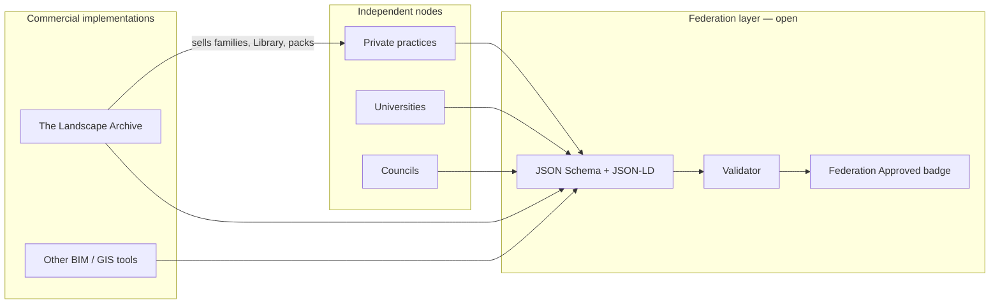

# Australian Landscape Architecture Federation — Open Metadata Schema

Public, decentralised metadata standard for Australian landscape architecture practice, academia, councils, and environmental bodies.

**Canonical URL (target):** https://schema.landscapefederation.org.au

## How it works



1. **Nodes stay independent** — each practice or university owns projects and internal workflows.
2. **Federation owns the vocabulary** — open schema files (Project, Botanical asset, Site context, Sustainability, Cultural context) published on a **separate domain**.
3. **Anyone can validate** — export a JSON bundle, run the validator, earn a **Federation Approved** badge when criteria are met.
4. **Implementations compete on quality** — Landscape Archive (and others) map the open schema to Revit, GIS, and asset libraries and may **sell** premium deliverables on top.

## Can Landscape Archive still sell plants?

**Yes.** The federation schema is the **shared language**, not the product store.

| Layer | What it is | Can you charge? |
|-------|------------|-----------------|
| Federation schema | Open JSON fields, validator, badge rules | No — free to use |
| Federation registry (future) | Member-uploaded open assets tagged with schema | Open-licence assets only |
| **Landscape Archive** | Library, Revit families, shop packs, subscriptions, certification | **Yes — unchanged** |

Analogy: **HTML is free; you can still sell websites.** Federation metadata is free; Landscape Archive sells BIM-ready families, data pipelines, Hub, and Studio tooling that **implements** the standard.

Commercial products may reference federation fields via `implementationProductRef` without merging commerce into the open standard.

## Repository layout

```
federation/
  schema/           JSON Schema modules + manifest.json
  context/          JSON-LD @context
  examples/         Worked bundle exports
  crosswalk/        LA Revit mapping
  portal/           Static developer portal (deployed separately)
```

## Commands

```bash
npm run federation:validate   # check example bundles
npm run federation:build    # assemble dist/ for Pages deploy
npm run federation:deploy   # deploy to Cloudflare Pages (separate project)
```

## Licence

- **Schema files** — Apache-2.0 (see `LICENSE-APACHE`)
- **Documentation** — CC BY 4.0 (see `LICENSE-CC-BY`)

Landscape Archive application code, connectors, and canonical species datasets remain under separate commercial / IP terms.

## Related docs

- [HOW_IT_WORKS.md](./HOW_IT_WORKS.md) — plain-language guide
- [COMMERCIAL_SEPARATION.md](./COMMERCIAL_SEPARATION.md) — federation vs Landscape Archive
- [GOVERNANCE.md](./GOVERNANCE.md) — draft council model
- [DOMAIN_SETUP.md](./DOMAIN_SETUP.md) — DNS and Cloudflare Pages for `schema.landscapefederation.org.au`
