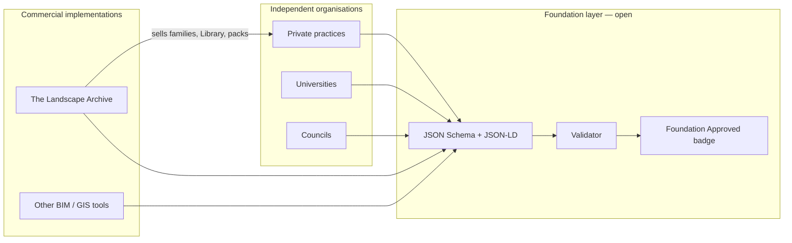

# 185 — Landscape Archive Foundation open standard

Public mirror of the **185** field dictionary and JSON Schema modules.
**169** (169 fields) remains supported for existing bundles.

**Licence:** [CC BY-NC-ND 4.0](LICENSE) — non-commercial reference use without modification.
**Commercial implementation:** [Contact The Landscape Archive Pty Ltd](https://landscapearchive.com.au/contact?topic=foundation-commercial-licence)

| Resource | Path |
|----------|------|
| **185** field dictionary (185 fields) | `tla185-fields.json` |
| 169 field dictionary (169 fields) | `tla169-fields.json` |
| JSON Schema modules | `schema/` |
| 185 RFC | `rfc/TLA-185-climate-screening-rfc.md` |
| Run-01 crosswalk | `crosswalk/tla185-run01-environment-map.md` |
| Band mapping reference | `lib/tla185-band-mapping.mjs` |
| Worked examples | `examples/` |
| Badge criteria | `BADGE_CRITERIA_v1.md` |
| Governance | `GOVERNANCE.md` |

**Releases:** [185-v1.0.0](https://github.com/marknorlanlaririt-ai/landscape-archive-foundation/releases/tag/185-v1.0.0) · [169-v1.0.0](https://github.com/marknorlanlaririt-ai/landscape-archive-foundation/releases/tag/169-v1.0.0)

**Live registry:** https://landscapearchive.com.au/foundation/registry
**Schema portal:** https://la-federation-schema.pages.dev

---

## 185 summary

185 extends 169 with **16 fields** for:

- Historical SILO scalars (`aridityIndex`, vapour pressure, pan evaporation, DEA land-cover band)
- **2050 climate projection screening** (`climateScreening.projection.*`)
- **Site bushfire overlay screening** (`siteRisk.*`)
- **2050 disclosure bands** on `siteContext.climateBand`

See `rfc/TLA-185-climate-screening-rfc.md` for the full specification.

---

Public, open metadata standard for Australian landscape architecture projects — stewarded by the **Landscape Archive Foundation** for use by practices, academia, councils, and environmental bodies.

> **Status:** early-stage, draft v1. The Foundation is **not yet an incorporated body or registered entity**, and **is not affiliated with, endorsed by, or representative of** any professional institute, association, or government body.

**Canonical URL (interim):** https://la-federation-schema.pages.dev  
**Target URL:** https://schema.landscapefoundation.org.au (when registered)

## How it works



1. **Organisations stay independent** — each practice or university owns projects and internal workflows.
2. **The Foundation stewards the vocabulary** — open schema files (Project, Botanical asset, Site context, Sustainability, Cultural context) published on a **separate domain**.
3. **Anyone can validate** — export a JSON bundle, run the validator, earn a **Foundation Approved** badge when criteria are met.
4. **Implementations compete on quality** — Landscape Archive (and others) map the open schema to Revit, GIS, and asset libraries and may **sell** premium deliverables on top.

## Open source

| Asset | Licence |
|-------|---------|
| 185 field dictionary & JSON Schema modules | CC BY-NC-ND 4.0 |
| 169 field dictionary (supported base) | CC BY-NC-ND 4.0 |
| Foundation documentation | CC BY-NC-ND 4.0 |
| Reference validator code (`lib/`) | Apache-2.0 (where marked) |

v1 JSON property names (e.g. `federationSchemaVersion`) retain a legacy prefix for compatibility; governance and public docs use Foundation naming.

## Can Landscape Archive still sell plants?

**Yes.** The open standard is the **shared language**, not the product store.

| Layer | What it is | Can you charge? |
|-------|------------|-----------------|
| Open standard | Open JSON fields, validator, badge rules | No — free to use |
| Foundation registry (future) | Member-uploaded open assets tagged with schema | Open-licence assets only |
| **Landscape Archive** | Library, Revit families, shop packs, subscriptions, certification | **Yes — unchanged** |

Analogy: **HTML is free; you can still sell websites.** Foundation metadata is free; Landscape Archive sells BIM-ready families, data pipelines, Hub, and Studio tooling that **implements** the standard.

Commercial products may reference schema fields via `implementationProductRef` without merging commerce into the open standard.

## Repository layout

```
federation/
  schema/           JSON Schema modules + manifest.json
  context/          JSON-LD @context
  examples/         Worked bundle exports
  crosswalk/        LA Revit mapping
  portal/           Static developer portal (deployed separately)
```

## Commands

```bash
npm run federation:validate   # check example bundles
npm run federation:validate:bundle -- path/to/bundle.json [--badge] [--json]
npm run federation:build    # assemble dist/ for Pages deploy
npm run federation:deploy   # deploy to Cloudflare Pages (separate project)
```

## Related docs

- [HOW_IT_WORKS.md](./HOW_IT_WORKS.md) — plain-language guide
- [CHARTER.md](./CHARTER.md) — founding charter: power split, council, voting, arbitration (draft)
- [LEGAL_STRUCTURE_OPTIONS.md](./LEGAL_STRUCTURE_OPTIONS.md) — how to launch without forming a company
- [INCORPORATION_CHECKLIST.md](./INCORPORATION_CHECKLIST.md) — forming the incorporated association (chosen path)
- [ASSOCIATION_RULES.md](./ASSOCIATION_RULES.md) — objects + governance rules to attach to the application
- [INAUGURAL_MEETING_MINUTES.md](./INAUGURAL_MEETING_MINUTES.md) — founding meeting minutes template
- [FOUNDING_INVITATION.md](./FOUNDING_INVITATION.md) — invitation for founding supporters
- [COMMERCIAL_SEPARATION.md](./COMMERCIAL_SEPARATION.md) — Foundation vs Landscape Archive
- [GOVERNANCE.md](./GOVERNANCE.md) — draft council model
- [DOMAIN_SETUP.md](./DOMAIN_SETUP.md) — DNS and Cloudflare Pages for the schema portal
